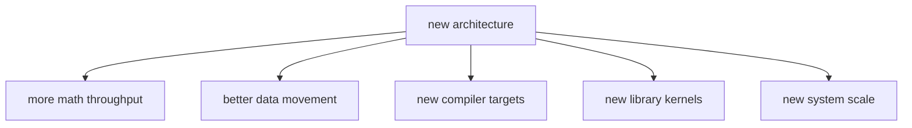

# Architecture Map

This is the map before going into details. The point is not memorizing every GPU SKU. The point is seeing what NVIDIA was optimizing for in each generation.

## Rough timeline

| Era | Architectures | What changed |
| --- | --- | --- |
| early CUDA | Tesla, Fermi, Kepler | CUDA becomes a real programming model |
| efficiency + memory | Maxwell, Pascal | better perf/watt, HBM2, NVLink |
| tensor core era | Volta, Turing | tensor cores, independent thread scheduling, RTX split |
| modern AI/HPC | Ampere | TF32, BF16, sparsity, MIG, async copy |
| graphics AI branch | Ada | RTX 40/L4/L40, `sm_89` |
| async datacenter era | Hopper | TMA, clusters, DSM, FP8, `sm_90` |
| AI factory era | Blackwell | FP4/NVFP4, NVLink 5, multi-die single GPU |
| rack-scale next | Rubin | NVLink 6, Vera CPU + Rubin GPU platform |

## The pattern I should look for

Usually the real story is not just more FLOPS. It's some combo of:

- getting data to the math units faster
- using smaller number formats safely
- letting blocks/SMs cooperate more
- making multi-GPU look more like one huge machine
- hiding movement behind compute

## Checklist

- [ ] Draw the CUDA hierarchy from thread to rack.
- [ ] Map architecture names to compute capabilities.
- [ ] Separate graphics-focused and datacenter-focused branches.
- [ ] Track when Tensor Cores show up.
- [ ] Track when async copy becomes important.
- [ ] Track when cross-SM cooperation appears.
- [ ] Track when NVLink becomes central, not optional.
- [ ] Track which changes affect my CUDA code directly.

## Files here

- [comparison_axes.md](comparison_axes.md): what to compare across architectures
- [reading_plan.md](reading_plan.md): actual order to read these notes

## Sources

- https://developer.nvidia.com/cuda/gpus
- https://docs.nvidia.com/cuda/cuda-programming-guide/index.html
- https://docs.nvidia.com/cuda/parallel-thread-execution/index.html
- https://developer.nvidia.com/blog/nvidia-ampere-architecture-in-depth/
- https://developer.nvidia.com/blog/nvidia-hopper-architecture-in-depth/
- https://www.nvidia.com/en-us/data-center/technologies/blackwell-architecture/
- https://www.nvidia.com/en-us/data-center/technologies/rubin/
