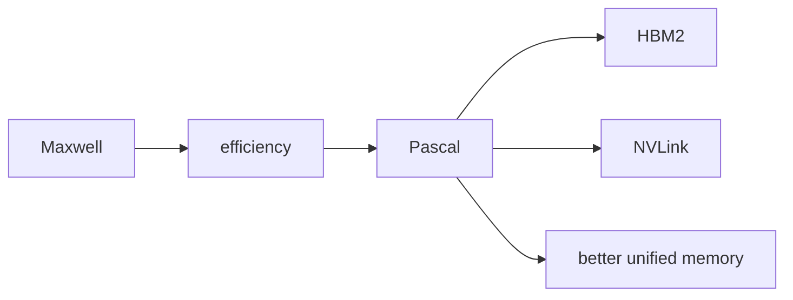

# Maxwell And Pascal

This is the bridge from older CUDA into the more modern accelerator story.

Maxwell is mostly "efficiency got much better". Pascal is where datacenter GPU stuff starts feeling closer to today's world because of HBM2 and NVLink.

## Maxwell

- better perf/watt
- more efficient SM design
- still useful for understanding why occupancy isn't the whole story
- compute capability around `sm_50`, `sm_52`, `sm_53`

## Pascal

- P100 brings HBM2
- NVLink becomes a real thing to care about
- unified memory gets more serious
- GP100 has a proper FP64 datacenter story
- compute capability around `sm_60`, `sm_61`, `sm_62`

## What I should learn here

- [ ] Why graphics GPUs and datacenter GPUs diverge.
- [ ] Why HBM matters so much for HPC.
- [ ] Why NVLink is not just a faster PCIe cable.
- [ ] How unified memory changes programmer ergonomics.
- [ ] Why FP64 is product-class dependent.

## Files here

- [maxwell.md](maxwell.md): Maxwell efficiency notes
- [pascal.md](pascal.md): Pascal / P100 notes
- [nvlink_and_hbm.md](nvlink_and_hbm.md): why HBM and NVLink matter

## Sources

- https://www.nvidia.com/en-us/data-center/pascal-gpu-architecture/
- https://docs.nvidia.com/cuda/pascal-tuning-guide/index.html
- https://developer.nvidia.com/cuda-legacy-gpus
