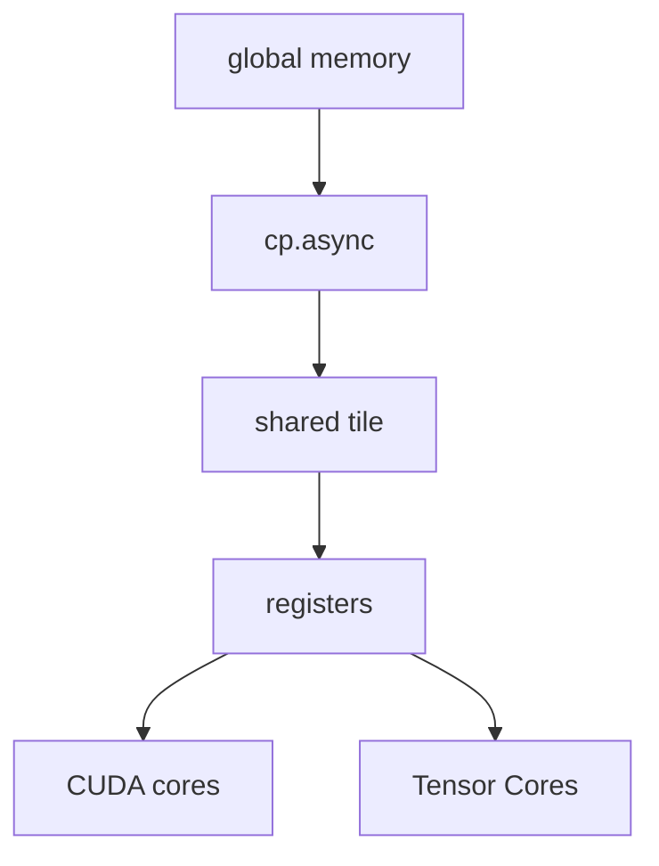

# Ampere

Ampere is probably the best "modern CUDA starts here" architecture.

There are two branches I need to keep separate:

- `sm_80`: A100/A30, datacenter GA100
- `sm_86`: RTX 30/A10/A40, GA10x style

They are both Ampere, but not the same thing.

## What changed

- third-gen Tensor Cores
- TF32, which is a huge practical thing for FP32-ish deep learning
- BF16 support
- structured sparsity
- bigger L1/shared memory on A100
- big L2 on A100
- MIG on A100
- async copy / `cp.async`
- PCIe Gen4 and NVLink on datacenter parts

## The mental model

Before Ampere, I can think:

> load global -> store shared -> sync -> compute

With Ampere, optimized kernels start thinking:

> while math is happening, start pulling next tile into shared memory

## What I should study

- [ ] naive matmul vs shared-memory tiled matmul
- [ ] cuBLAS TF32 behavior
- [ ] CUTLASS Ampere mainloops
- [ ] where `cp.async` appears
- [ ] what MIG actually partitions
- [ ] why `sm_80` and `sm_86` are not interchangeable

## Files here

- [sm_and_memory.md](sm_and_memory.md): Ampere SM/memory staging notes
- [tensor_cores_tf32.md](tensor_cores_tf32.md): TF32, BF16, structured sparsity
- [mig_async_copy.md](mig_async_copy.md): MIG vs `cp.async`

## Sources

- https://developer.nvidia.com/blog/nvidia-ampere-architecture-in-depth/
- https://www.nvidia.com/content/dam/en-zz/Solutions/Data-Center/nvidia-ampere-architecture-whitepaper.pdf
- https://www.nvidia.com/content/dam/en-zz/Solutions/geforce/ampere/pdf/NVIDIA-ampere-GA102-GPU-Architecture-Whitepaper-V1.pdf
- https://docs.nvidia.com/cuda/ampere-tuning-guide/index.html
- https://developer.nvidia.com/cuda/gpus
