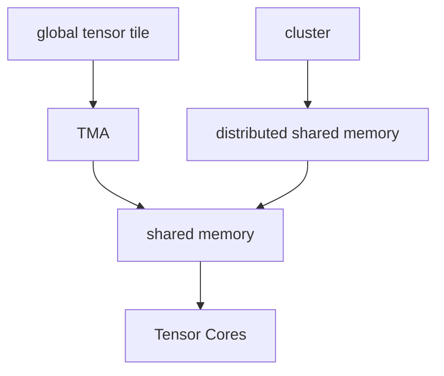

# Hopper

Hopper is the `sm_90` architecture: H100, H200, GH200.

This is where the mental model changes hard. It's not just more Tensor Cores. Hopper is more like:

> make data movement and synchronization explicit enough that Tensor Cores stay fed.

## What changed

- fourth-gen Tensor Cores
- FP8
- Transformer Engine
- TMA, Tensor Memory Accelerator
- thread-block clusters
- distributed shared memory
- async transaction barriers
- DPX instructions
- 256 KB combined L1/shared memory
- HBM3
- NVLink 4 / NVLink Switch
- better MIG / confidential computing story

## Targets

| Target | Meaning |
| --- | --- |
| `sm_90` | generic Hopper |
| `sm_90a` | Hopper-specific, not generic portable Hopper |

So default to `sm_90`. Use `sm_90a` only when I know the feature needs it.

## What I should study

- [ ] CUTLASS Hopper GEMM.
- [ ] TMA loads.
- [ ] thread-block clusters.
- [ ] distributed shared memory.
- [ ] async barriers.
- [ ] FP8 formats and scaling.
- [ ] Nsight Compute tensor/memory metrics on Hopper kernels.

## Files here

- [sm_clusters_tma.md](sm_clusters_tma.md): clusters, DSM, TMA
- [fp8_transformer_engine.md](fp8_transformer_engine.md): FP8 and Transformer Engine notes
- [memory_interconnect.md](memory_interconnect.md): HBM3, L2/shared, NVLink

## Sources

- https://developer.nvidia.com/blog/nvidia-hopper-architecture-in-depth/
- https://resources.nvidia.com/en-us-tensor-core/nvidia-tensor-core-gpu-architecture
- https://docs.nvidia.com/cuda/hopper-tuning-guide/index.html
- https://docs.nvidia.com/cuda/cuda-programming-guide/index.html
- https://docs.nvidia.com/cuda/parallel-thread-execution/index.html
