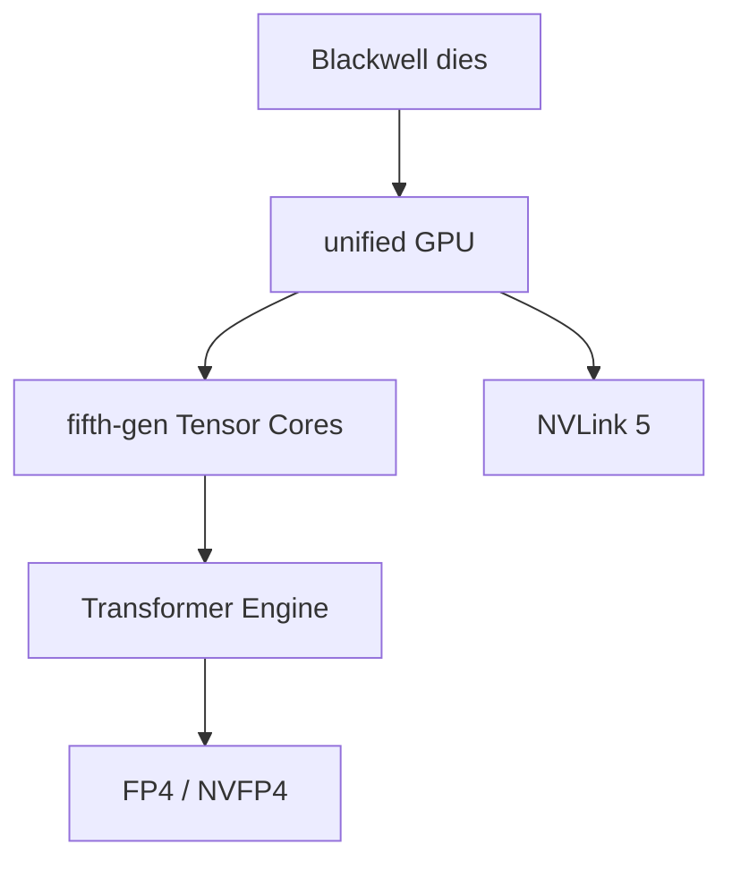

# Blackwell

Blackwell is messy in the exact way modern NVIDIA architectures are messy: same brand, multiple targets.

So first rule:

> don't say "Blackwell" when I actually mean `sm_100`, `sm_103`, `sm_120`, or `sm_121`.

## What changed

- data-center Blackwell uses two reticle-limited dies as one unified GPU
- fifth-gen Tensor Cores
- second-gen Transformer Engine
- FP4 / NVFP4 direction
- micro-tensor scaling
- Blackwell Ultra improves attention and AI FLOPS over Blackwell
- NVLink 5 scale-up story
- confidential computing becomes a big platform feature
- more RAS / AI factory framing

## Targets

| CC | Examples | Target idea |
| --- | --- | --- |
| 10.0 | B200, GB200 | `sm_100` |
| 10.3 | B300, GB300 | `sm_103` |
| 12.0 | RTX PRO Blackwell, RTX 50 | `sm_120` |
| 12.1 | GB10 / DGX Spark | `sm_121` |

I did not find `sm_91` in the public NVIDIA docs I checked. So don't use that as a real target unless local CUDA docs prove it.

## What I should study

- [ ] Which CUDA Toolkit supports each Blackwell target.
- [ ] PTX notes for FP4/FP6/FP8 style conversions.
- [ ] What NVFP4 actually buys.
- [ ] What Transformer Engine handles automatically.
- [ ] CUTLASS Blackwell kernels.
- [ ] What is exposed to CUDA vs hidden inside libraries.
- [ ] Difference between datacenter Blackwell and RTX Blackwell.

## Files here

- [targets_and_datatypes.md](targets_and_datatypes.md): target split and FP4/NVFP4
- [nvlink_and_system.md](nvlink_and_system.md): NVLink 5 and AI factory system view
- [sm_questions.md](sm_questions.md): things to verify as CUDA docs/tooling expose more

## Sources

- https://www.nvidia.com/en-us/data-center/technologies/blackwell-architecture/
- https://resources.nvidia.com/en-us-blackwell-architecture
- https://developer.nvidia.com/cuda/gpus
- https://docs.nvidia.com/cuda/parallel-thread-execution/index.html
- https://docs.nvidia.com/data-center-gpu/line-card.pdf
