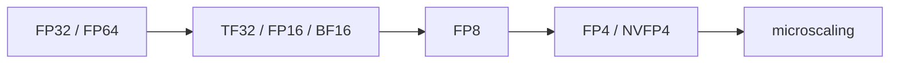

# Blackwell Targets And Data Types

Blackwell target naming is the place where I should be extra careful.

| CC | Example products | Target idea |
| --- | --- | --- |
| 10.0 | B200 / GB200 | `sm_100` |
| 10.3 | B300 / GB300 | `sm_103` |
| 12.0 | RTX 50 / RTX PRO Blackwell | `sm_120` |
| 12.1 | GB10 / DGX Spark | `sm_121` |

## Data type direction

The arc looks like this:

Lower precision is not just smaller numbers. It means scaling, calibration, accumulation choices, and library support.

## Checklist

- [ ] Read PTX conversion notes for low-precision formats.
- [ ] Understand FP8 before FP4.
- [ ] Understand why NVFP4 needs scaling.
- [ ] Learn what TensorRT-LLM / cuBLAS / CUTLASS do for this.
- [ ] Check whether a feature is CUDA-visible or library-managed.
- [ ] Keep datacenter Blackwell separate from RTX Blackwell.

## Sources

- https://www.nvidia.com/en-us/data-center/technologies/blackwell-architecture/
- https://resources.nvidia.com/en-us-blackwell-architecture
- https://developer.nvidia.com/cuda/gpus
- https://docs.nvidia.com/cuda/parallel-thread-execution/index.html

