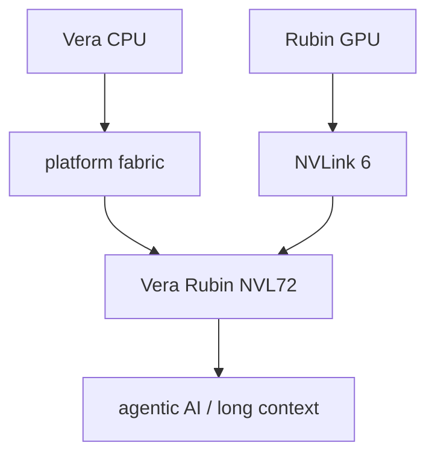

# Vera Rubin

Rubin is newer, so I should be careful here.

For Hopper and Blackwell, there are clearer CUDA target details. For Rubin, NVIDIA is currently talking more about the platform: Vera CPU, Rubin GPU, NVLink 6, rack-scale AI systems.

So this folder is more like:

> track what's public now, don't invent missing CUDA details.

## What NVIDIA is emphasizing

- agentic AI
- long-context / reasoning workloads
- Vera CPU + Rubin GPU as a platform
- third-gen Transformer Engine
- adaptive compression
- NVFP4 inference
- NVLink 6
- full-rack confidential computing
- RAS / reliability
- rack systems like Vera Rubin NVL72

## Mental model

The important thing: Rubin is not just "next GPU". It is NVIDIA pushing the whole rack as the unit of compute.

## What to track later

- [ ] official compute capability
- [ ] first CUDA Toolkit support
- [ ] PTX target strings
- [ ] tuning guide
- [ ] CUTLASS support
- [ ] Nsight metric changes
- [ ] what is exposed to CUDA vs only through libraries/systems

## Files here

- [platform_notes.md](platform_notes.md): platform pieces and caution notes
- [nvlink6_and_rack.md](nvlink6_and_rack.md): NVLink 6 / rack-scale notes
- [future_cuda_tracking.md](future_cuda_tracking.md): what to update when CUDA docs catch up

## Sources

- https://www.nvidia.com/en-us/data-center/technologies/rubin/
- https://www.nvidia.com/en-us/data-center/vera-rubin-nvl72/
- https://docs.nvidia.com/data-center-gpu/line-card.pdf
- https://developer.nvidia.com/cuda/gpus
