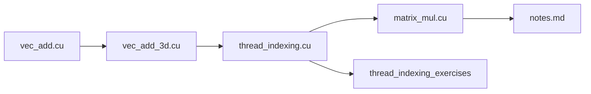

# CUDA Basics

This directory is for the first layer: launching kernels, indexing threads, moving data, and writing the first matrix/vector kernels.

## Files

| File | Focus |
| --- | --- |
| `vec_add.cu` | First 1D vector-add kernel |
| `vec_add_3d.cu` | Mapping 3D launch geometry to data |
| `thread_indexing.cu` | Thread/block indexing formulas |
| `matrix_mul.cu` | First matrix multiplication pass |
| `thread_indexing_exercises/` | Manual indexing problems |
| `notes.md` | Local device capability notes |
