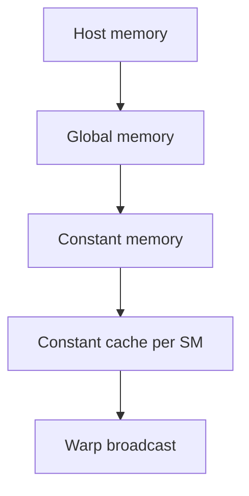

# CUDA Memory

This directory is for memory spaces and access behavior.

## Topics

| Directory | Focus |
| --- | --- |
| `constant_memory/` | Read-only cached memory for small shared coefficients |
