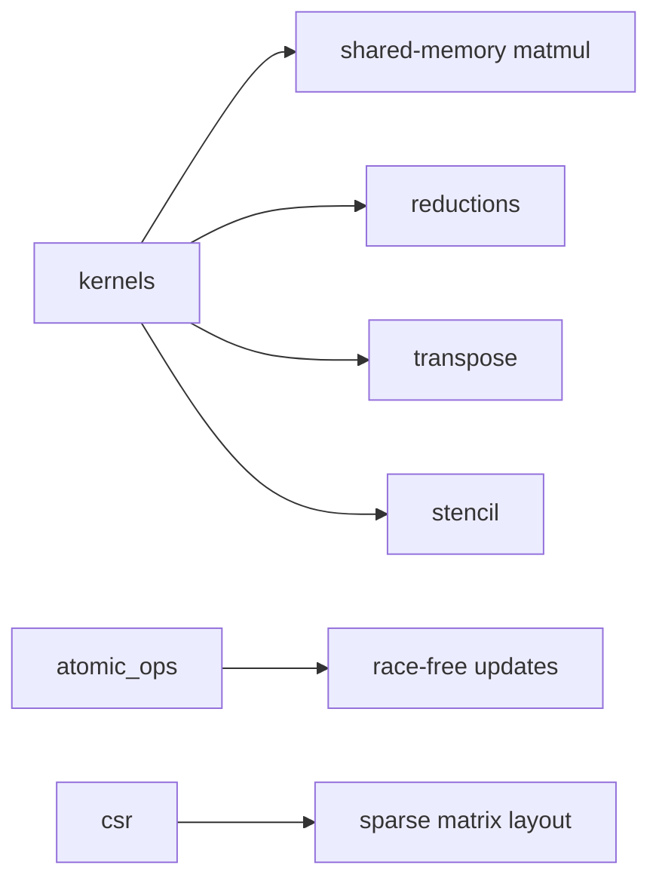

# Kernels And Data Structures

This directory is for custom kernels, synchronization hazards, and data-layout experiments.

## Topics

| Directory | Focus |
| --- | --- |
| `kernels/` | Core kernel exercises and benchmarks |
| `atomic_ops/` | Atomic vs non-atomic behavior |
| `csr/` | Sparse matrix encoding/decoding |
