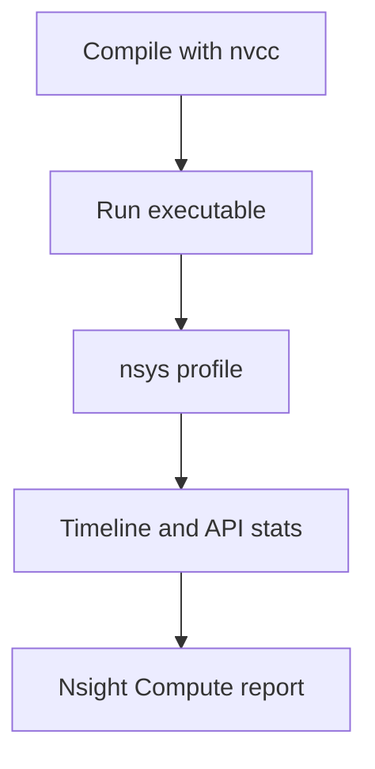

# Profiling

This directory is for timing kernels and reading profiler output.

## Files

| Path | Focus |
| --- | --- |
| `benchmark.md` | Kernel benchmark notes |
| `profiling/` | NVTX, Nsight Systems, Nsight Compute reports |
