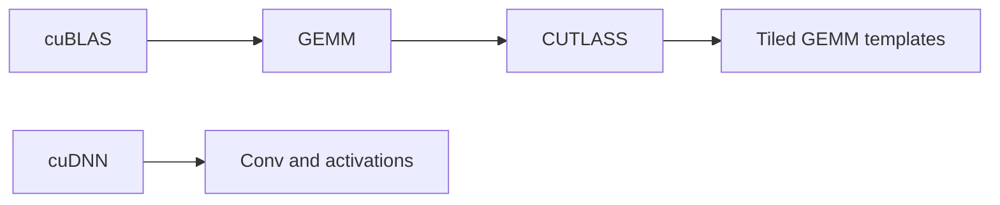

# CUDA Libraries

This directory is for higher-level NVIDIA libraries.

```mermaid
flowchart LR
  A[cuBLAS] --> B[GEMM]
  C[cuDNN] --> D[Conv and activations]
  E[CUTLASS] --> F[Tiled GEMM templates]
  B --> E
```

## Topics

| Directory | Focus |
| --- | --- |
| `cuda_api/` | cuBLAS, cuDNN, and CUTLASS experiments |
