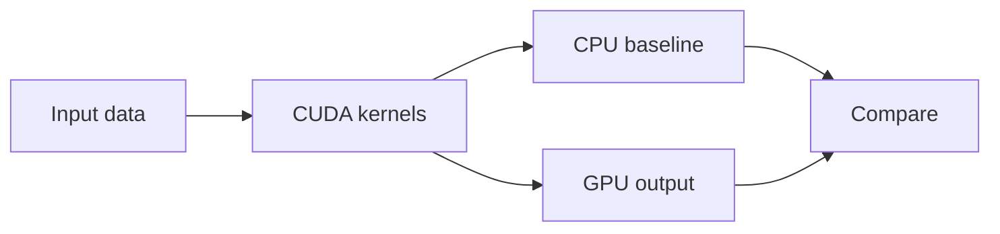

# Projects

This directory is for applied CUDA projects that are bigger than a single kernel note.

## Projects

| Directory | Focus |
| --- | --- |
| `edge_detection/` | GPU edge-detection project pointer |
