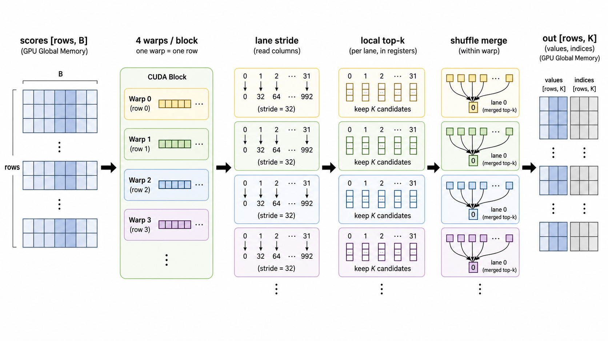
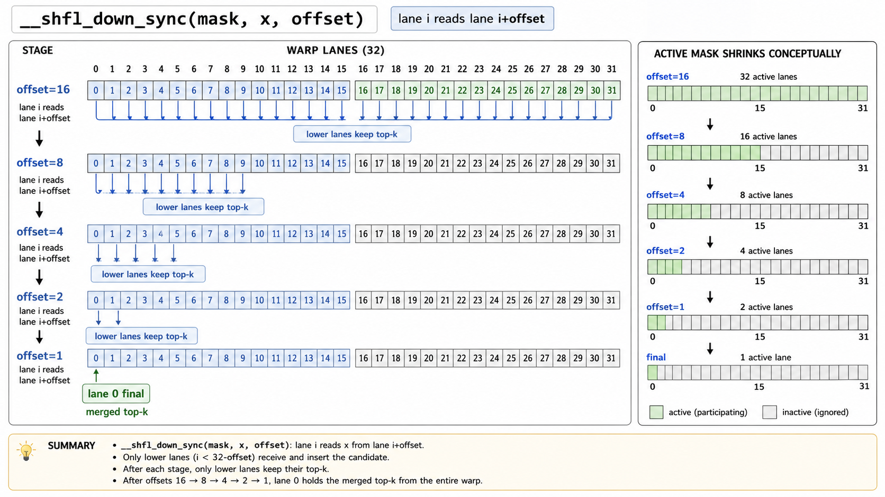

# Warp top-k kernel

This is the top-k piece for the block score tensor. I am not taking top-k over the full sequence directly here. The sequence is already grouped into blocks, so the kernel sees:

```text
scores: [rows, B]
B = ceil(seq_len / B_k)
```

For every row, it returns the best `K` block ids and their scores:

```text
out_values:  [rows, K]
out_indices: [rows, K]
```



## Kernel split

The kernel is easier to read if we split it into these parts:

```text
global scores [rows, B]
        |
        v
CUDA block
  warp 0 -> row r
  warp 1 -> row r + 1
  warp 2 -> row r + 2
  warp 3 -> row r + 3
        |
        v
each warp scans one row with 32 lanes
        |
        v
each lane keeps local top-k in registers
        |
        v
warp shuffle merge
        |
        v
lane 0 writes [K] values and indices
```

So one CUDA block has `4` warps, and each warp owns one row. That means one block can process four rows at once.

## Why no exp

If the scores later go into softmax, top-k still does not need to compute `exp(score)`.

The reason is simple: `exp` keeps the same ordering.

```text
score_a < score_b  =>  exp(score_a) < exp(score_b)
```

Example:

```text
raw scores:  [1.2, -0.5, 3.0]
exp scores:  [3.32, 0.60, 20.08]
order:        3.0 > 1.2 > -0.5
```

The best entries are the same before and after exp, so the kernel compares raw scores directly. That saves special-function work and keeps the top-k path about ordering only.

## Lane stride

Inside one row, the warp splits the columns by lane id.

For `num_blocks = 100`:

```text
lane 0  -> block 0,  32, 64, 96
lane 1  -> block 1,  33, 65, 97
lane 2  -> block 2,  34, 66, 98
...
lane 31 -> block 31, 63, 95
```

This is the `for (int b = lane; b < num_blocks; b += 32)` loop. At each stride, lanes 0..31 read adjacent block ids, so the reads are shaped nicely for the warp.

## Local top-k

Each lane keeps its own small top-k set in registers:

```text
vals[K] = scores
idxs[K] = block ids
```

The important invariant is:

```text
vals[0] is the current weakest kept score
```

That makes the insert check cheap:

```text
if incoming <= vals[0]:
    reject
else:
    replace vals[0]
    scan K entries and move the new minimum back to vals[0]
```

Tiny example with `K = 4`:

```text
current kept scores: [4, 9, 6, 7]
vals[0] = 4

incoming = 3  -> reject, because 3 <= 4
incoming = 8  -> replace 4

after replace:     [8, 9, 6, 7]
after refresh_min: [6, 9, 8, 7]
```

The array is not fully sorted during scanning. It only maintains the minimum-root trick. Sorting is only done at the end if `sort_output = true`, so the printed output is easier to read.

## Shuffle merge

After scanning, each lane has `K` candidates. Now the warp needs one final top-k for the whole row.

This is where `__shfl_down_sync` comes in.

```cpp
__shfl_down_sync(mask, x, offset)
```

It means: inside this warp, give me the value of `x` from lane `lane_id + offset`.

Example for `offset = 16`:

```text
lane 0 gets lane 16's value
lane 1 gets lane 17's value
...
lane 15 gets lane 31's value
```

Then only the lower lanes insert those received candidates:

```cpp
if (lane < offset) {
    insert_topk_minroot(other_v, other_i, vals, idxs);
}
```

Visually, it is a tree:



The stages are:

```text
offset = 16  -> lanes 0..15 merge lanes 16..31
offset = 8   -> lanes 0..7  merge lanes 8..15
offset = 4   -> lanes 0..3  merge lanes 4..7
offset = 2   -> lanes 0..1  merge lanes 2..3
offset = 1   -> lane 0      merges lane 1
```

After that, lane 0 has the row's final top-k.

## What the mask means

In this code:

```cpp
unsigned mask = 0xffffffffu;
```

That means all 32 lanes are participating in the warp collective.

This mask is not a shared-memory bank mask. It is a warp participation mask. Since the whole warp is alive for the merge, the full mask is fine. The `if (lane < offset)` is what decides which lanes actually keep the incoming candidates.

## Writeback

Only lane 0 writes:

```text
out_values[row * K + i]  = vals[i]
out_indices[row * K + i] = idxs[i]
```

If sorting is enabled, lane 0 sorts the final `K` entries descending before writing. The selection logic works without sorting; sorting just makes the output stable to inspect.

## Build and run

From the repo root:

```bash
nvcc -std=c++17 07_projects/msa/top_k.cu -o /tmp/top_k
/tmp/top_k 4 4096 128
```

Here `seq_len = 4096` and `B_k = 128`, so:

```text
B = ceil(4096 / 128) = 32
input shape = [rows, 32]
```
