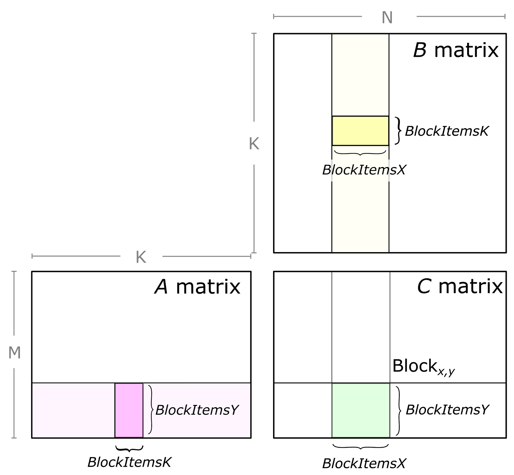
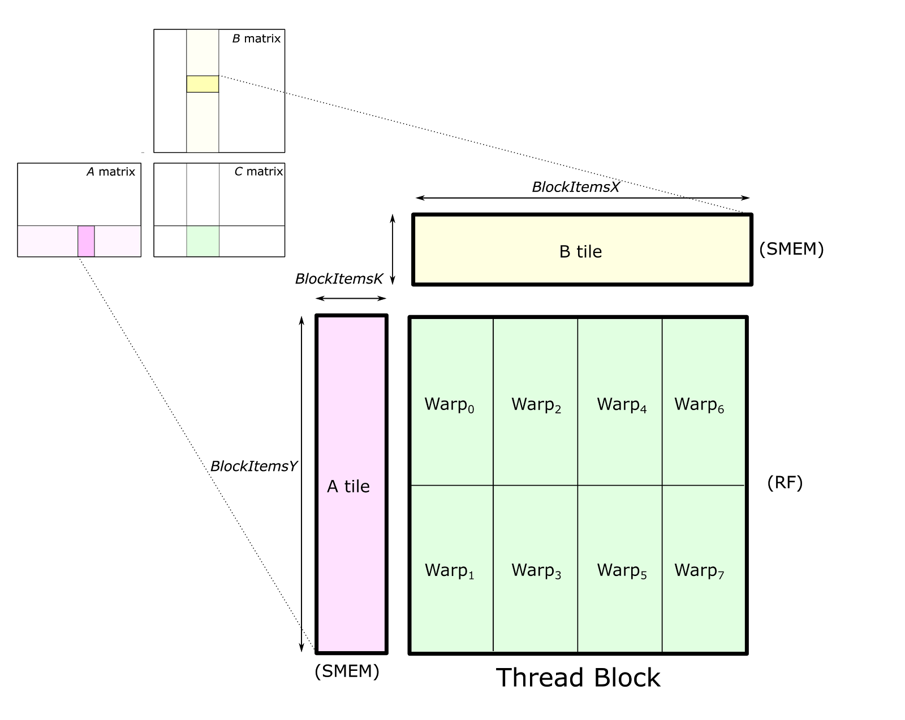
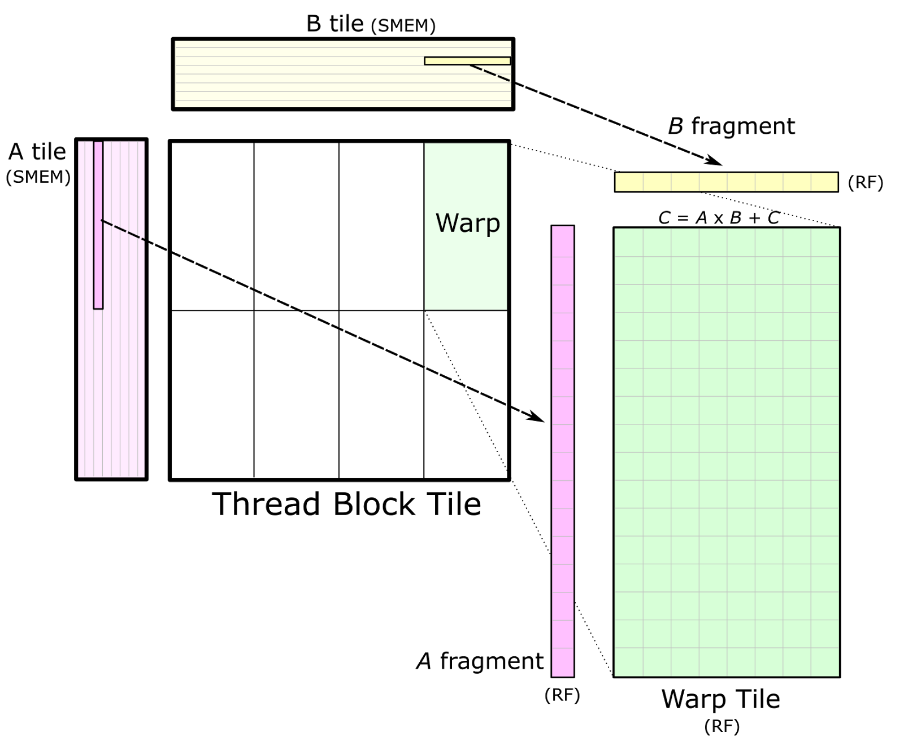
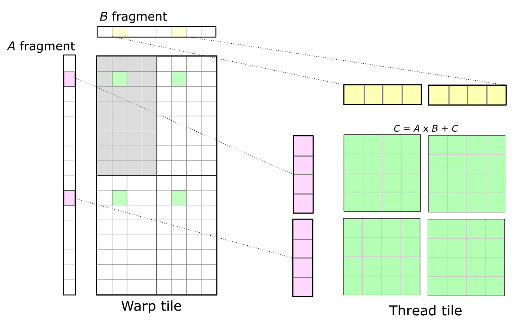
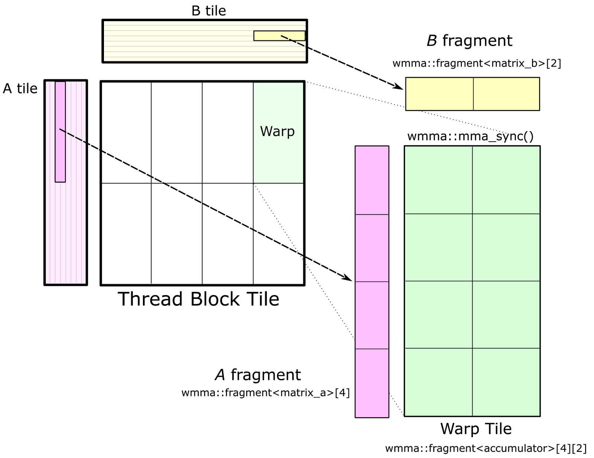

# CUTLASS

CUTLASS (CUDA Templates for Linear Algebra Subroutines and Solvers) is a collection of CUDA C++ template abstractions for implementing high-performance matrix-multiplication (GEMM) at all levels and scales within CUDA.

Referring this blog: https://developer.nvidia.com/blog/cutlass-linear-algebra-cuda/

So the problem they are addressing is that, everytime something costly happens in gpu as in like matrix multiplication or related ops, we need to access the global memory which is costly as well as time consuming. First of all, they teach how to do matmul using the three loops itself

First version: naive
```cpp
for (int i=0;i<M;i++){
  for(int j=0;j<N;j++){
    for(int k=0;k<K;k++){
      C[i][j] += A[i][k] * B[k][j];
    }
  }
}
```
so here loading the col and row of A and Bfrom global mem is costly. So in the next iteration we just move the k thing outside of the loop leeting the col and row of A and B to be loaded and say never used, after this iteration.

Second version: loop order change
```cpp
for(int k=0;k<K;k++){
  for (int i=0;i<M;i++){
    for(int j=0;j<N;j++){
      C[i][j] += A[i][k] * B[k][j];
    }
  }
}
```
> One concern with this approach is that it requires all M-by-N elements of C to be live to store the results of each multiply-accumulate instruction, ideally in memory that can be written as fast as the multiply-accumulate instruction can be computed.

third version: tiling

now we tile the access of row and col of A and B, mtile and ntile, so that it just fits on the on chip ram, which is more useful.
```cpp
for(int m=0;m<M;m+=mtile){
  for(int n=0;n<N;n+=ntile){
    for(int k=0;k<K;k++){
      for(int i=0;i<mtile;i++){
        for(int j=0;j<ntile;j++){
          int row = m + i;
          int col = n + j;
          C[row][col] += A[row][k] * B[k][col];
        }
      }
    }
  }
}
```

## Hierarchical GEMM Structure

CUTLASS applies the tiling structure to implement GEMM efficiently for GPUs by decomposing the computation into a hierarchy of thread block tiles, warp tiles, and thread tiles and applying the strategy of accumulating matrix products.


Here, you can see data movement from global memory to shared memory (matrix to thread block tile), from shared memory to the register file (thread block tile to warp tile), and from the register file to the CUDA cores for computation (warp tile to thread tile).

> Thread block tile: so its the first level of mem access from the global mem, its also spatially partitioned across warps, so also known as `accumulator`. Each accumulator is updated once per math operation, so it needs to reside in the fastest memory in the SM: the register file.

  
  

> warp tile: Once data is stored in shared memory, each warp computes a sequence of accumulated matrix products by iterating over the K dimension of the thread block tile, loading submatrices (or fragments) from shared memory, and computing an accumulated outer product.

  

> thread tile: The CUDA Programming Model is defined in terms of thread blocks and individual threads. Consequently, the warp structure is mapped onto operations performed by individual threads. Threads cannot access each other’s registers, so we must choose an organization that enables values held in registers to be reused for multiple math instructions executed by the same thread. This leads to a 2D tiled structure within a thread as the detailed view in Figure 5 shows. Each thread issues a sequence of independent math instructions to the CUDA cores and computes an accumulated outer product.

  

---

should read this later: https://developer.nvidia.com/blog/programming-tensor-cores-cuda-9/

---

## WMMA API

WMMA -> cuda warp matrix multiply-accumulate API. Its an alternative for the thread tile, instead it provides an abstraction to the programmer for warp-cooperative matrix fragment load / store and multiply-accumulate math operations.


CUTLASS implements a GEMM based on the WMMA API in the file block_task_wmma.h. The warp tile must have dimensions that are multiples of matrix multiply-accumulate shapes defined by the nvcuda::wmma templates for the target CUDA Compute Capability.
> In CUDA 9.0, the fundamental WMMA size is 16-by-16-by-16.

---

Occupancy: no. of active warps per SM / max no. of warps per SM

High occupancy is crucial for maximizing performance, especially for memory-bound kernels. A high number of active warps allows the GPU to perform latency hiding. When one warp is stalled while waiting for a long-latency memory operation (like fetching data from global memory), the SM can switch to executing instructions from another ready warp.

---

## compare.cu - CUTLASS vs CUBLAS Performance Comparison

This script compares the performance of CUTLASS GEMM implementation against CUBLAS on the same matrix multiplication operations.

### Build Command:
```bash
nvcc compare.cu -o compare \
  -I/home/$(whoami)/cutlass/include \
  -I/home/$(whoami)/cutlass/tools/util/include \
  -lcublas \
  -O3 \
  -std=c++17 \
  --expt-relaxed-constexpr \
  -arch=sm_89 \
  && ./compare
```

### Timing Results:
- **CUBLAS SGEMM Time for 100 runs:** 28.1186 ms
- **Cutlass SGEMM Time for 100 runs:** 26.2378 ms

The CUTLASS implementation shows approximately **6.7% performance improvement** over CUBLAS on this hardware configuration (SM 8.9).

