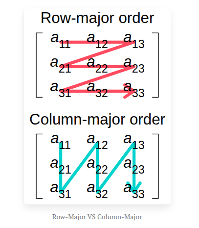
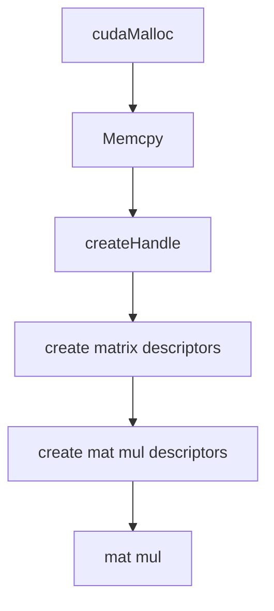

# cuBLAS

so these all boil down to matrix mul and linear algebar ops. And this library is the state of the art in doing them. It stands for <b><i>cuda basic linear algebra subroutines</i></b>

and then there are many variant in this, lemme update it as i read tho
- cuBLASlt
- cudBLASxt
- cuBLASDx

And last comes <b>CUTLASS</b>, which can be used to fue kernels as in <i>flash-attention</i> to get the max output, as we need to get store the result in <b>HBM</b><i>(high-bandwidth mem)</i> and get back the results from it, instead tile them store it in sram available in each sms, and then retireve and process more faster. So this was the idea of flash-attenetion, let's see how i'm gonna use it.

the matrix mul is a bit cracked over here, as cuda take <b>colum-major</b>, as in when a matrix is given like this, it interprests like this, whereas c/c++ take it as row-major



---

### sgemm vs hgemm

check this script: [sgemm_hgemm.cu](sgemm_hgemm.cu)

results:
 nvcc sgemm_hgemm.cu -o sgemm_hgemm -lcublas && ./sgemm_hgemm
Matrix sizes: M=8192, N=8192, K=8192
Estimated GPU memory usage: 1.12 GB

Sample CUBLAS SGEMM Results (first 5x5 block):
| Col 0 | Col 1 | Col 2 | Col 3 | Col 4 |
|---------|---------|---------|---------|---------|
| 202062.45 | 202923.62 | 201036.56 | 200185.86 | 200570.17 |
| 199339.61 | 199351.12 | 200286.06 | 198719.69 | 198125.89 |
| 200642.75 | 199398.78 | 200617.91 | 198644.61 | 199260.06 |
| 200016.61 | 199653.33 | 198613.52 | 198887.62 | 199084.45 |
| 203695.62 | 204948.42 | 203191.11 | 200763.20 | 203300.89 |

Sample CUBLAS HGEMM Results (first 5x5 block):

| Col 0 | Col 1 | Col 2 | Col 3 | Col 4 |
|-------|-------|-------|-------|-------|
| inf | inf | inf | inf | inf |
| inf | inf | inf | inf | inf |
| inf | inf | inf | inf | inf |
| inf | inf | inf | inf | inf |
| inf | inf | inf | inf | inf |

Performance:

CUBLAS SGEMM Time: 0.191532 seconds (5740.61 GFLOPS)

CUBLAS HGEMM Time: 0.061726 seconds (17812.88 GFLOPS)

HGEMM Speedup: 3.10x

even though hgemm is faster, the results are inf, so it's not usable in this case. so fuck it, it is caused by overflow.

this resource is also nice - [modal-gpu-glossary](https://modal.com/gpu-glossary/host-software/cublas)

---

Next up with <b>cuBLASLt</b>, fuck this shit bruh, its so diffcicult, as in we need to initialize more things before using it.

### cuBLASLt

this is the lightweight version of cuBLAS, designed for more flexibility and better performance on specific workloads. I need to discover the "specific workloads" tho?

some terms to know:
- CUDA_R_32F -> 32 bit floating point number, and the "R" is just for real number description, not complex numbers.
- CUBLASLT_MATMUL_DESC_TRANSA -> descriptor for transposing the first matrix in a matrix multiplication operation, and specifically for matrix A over here

the process is somthing like this


and also some weird thing: > from cublas-lt docs, search for "Dimensions m and k must be multiples of 4."
the reason is that:
```
cuBLASLt requires matrix dimensions to be multiples of 4 (or sometimes higher powers of 2) due to hardware memory alignment requirements and optimization for Tensor Cores and vectorized operations.
```

will research on this more and update later.

the script for cublasLt: [cublas_lt.cu](cublas_lt.cu)

results:
Time for cudaMalloc d_a_fp32: 1.913984
Time for cudaMalloc d_b_fp32: 0.000007
Time for cudaMalloc d_c_fp32: 0.000002
Time for cudaMemcpy d_a_fp32: 0.000328
Time for cudaMemcpy d_b_fp32: 0.000002
Time for cublasLtCreate: 0.001650
Time for cublasLtMatrixLayoutCreate (all 3): 0.000291
Time for cublasLtMatmul (fp32): 0.048033
Time for cudaMemcpy result (fp32): 0.000042
Time for half conversion: 0.000001
Time for cudaMemcpy (fp16): 0.000010
Time for cublasLtMatmulDescCreate (fp16): 0.000000
Time for cublasLtMatmul (fp16): 0.038677
Time for cudaMemcpy result (fp16): 0.000019
CUBLASLt fp32 Result:
106.00 116.00 126.00 136.00
234.00 260.00 286.00 312.00
362.00 404.00 446.00 488.00
490.00 548.00 606.00 664.00

CUBLASLt fp16 Result:
inf inf inf inf
inf inf inf inf
0.00 0.00 0.00 0.00
0.00 0.00 0.00 0.00
