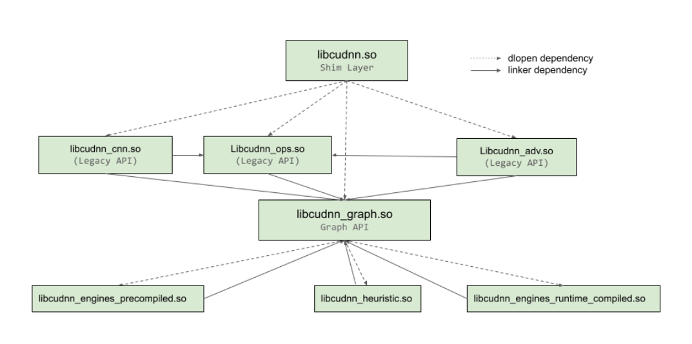
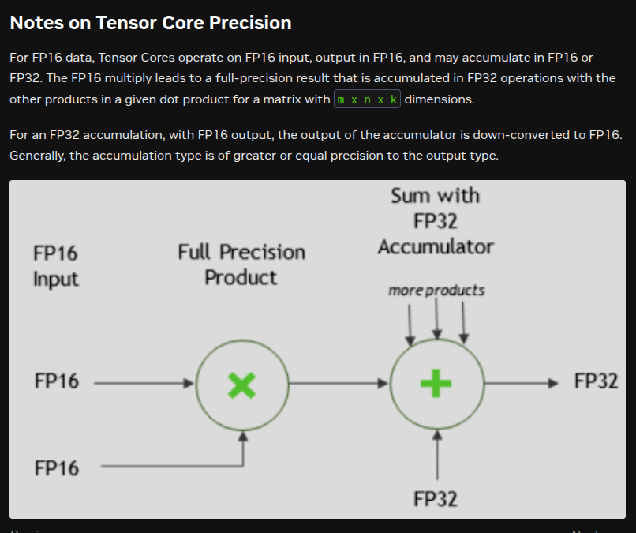
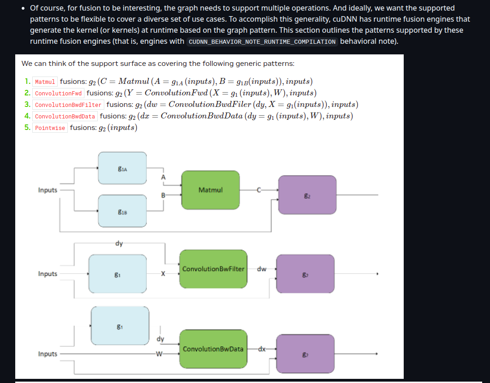
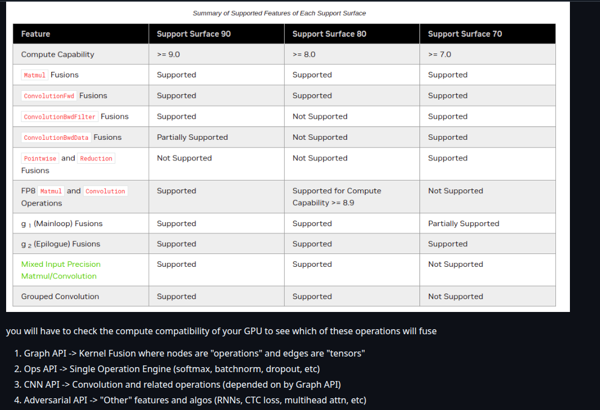
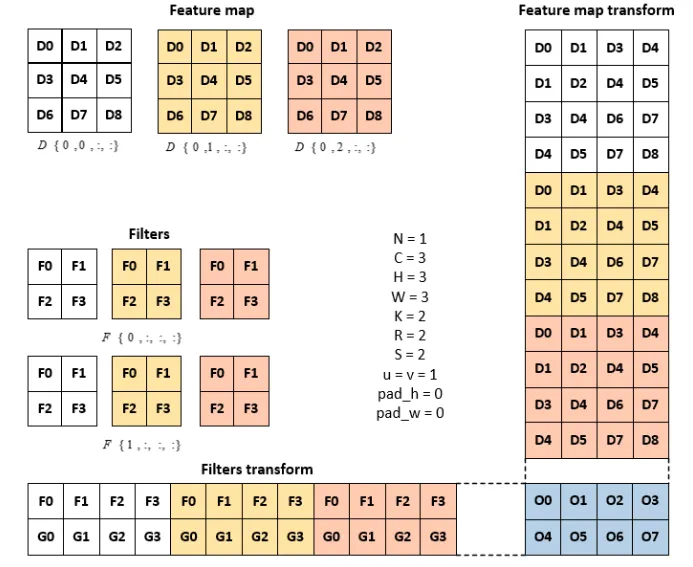
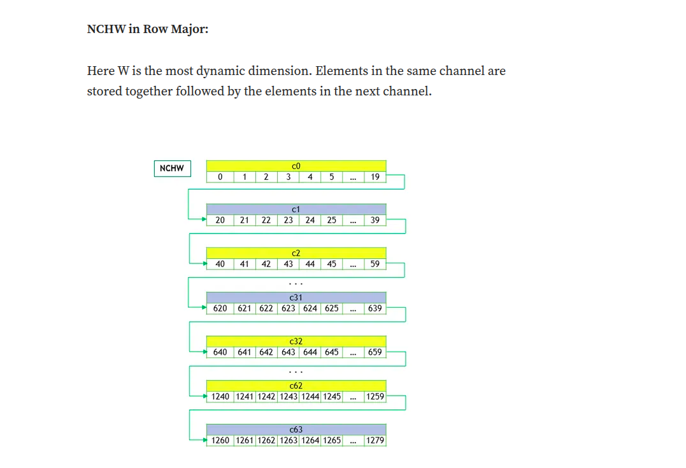
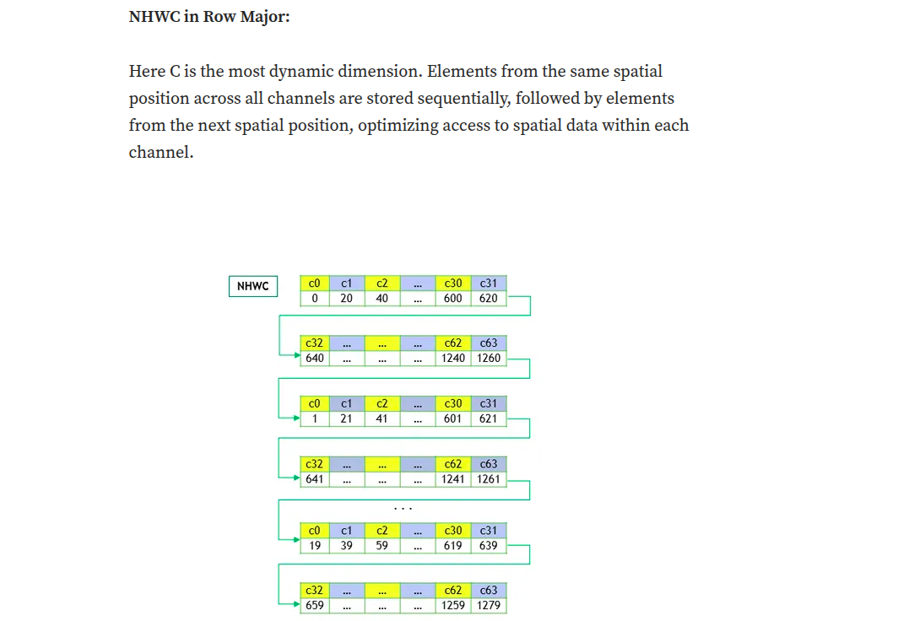
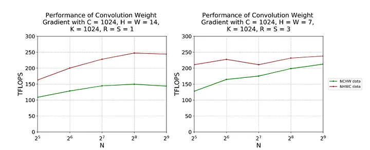

# cuDNN

nvidia cuDNN (cuda deep neural network library) is a collection of full optmiized seperate kernels for most of all the ops used in real-world deep learning models. So gonna explore this more.

Referring this official doc: https://docs.nvidia.com/deeplearning/cudnn/backend/latest/api/overview.html

im just exploring the backend as of now, also there's a frontend part of it. Will explore it later.

this is the overall arch:



## Core concepts:

1. cudnn handle: the handle is just like a context in other libraries, it holds all the state info required for cuDNN operations. It is created using `cudnnCreate` and destroyed using `cudnnDestroy`.
2. tensor core ops: Tensor Core operations accelerate matrix math operations; cuDNN uses Tensor Core operations that accumulate into FP16, FP32, and INT32 values. To set the math type to tensor core, use `CUDNN_TENSOR_OP_MATH`, the default one is `CUDNN_DEFAULT_MATH`.



### Legacy vs Graph API

<i>**Legacy API**</i> is the first version of cuDNN API, its just like, i give you this stpes, execute them in order. But <i>**Graph API**</i> is more flexible, as in you can create a graph of operations, and then execute them together and in the process they can be fused, optimized or rearranged for the best efficient implementation. This allows for better optimization and performance, as cuDNN can analyze the entire graph and optimize it as a whole.

---
some example ops:

`cudnnTensorDescriptor_t` - Opaque handle type that describes tensor metadata (dimensions, data type, strides, layout like NCHW/NHWC)[web:33][web:34].

`cudnnHandle_t` - Context handle that manages cuDNN library state and GPU resources for all operations[web:35][web:36].

`cudnnConvolutionDescriptor_t` - Descriptor that defines convolution operation parameters (padding, stride, dilation, mode)[web:35].

`cudnnFilterDescriptor_t` - Descriptor that specifies convolution filter/kernel properties (dimensions, data type, layout)[web:37].

`cudnnCreateTensorDescriptor` - Function that allocates and initializes an empty tensor descriptor object[web:33][web:35].

`cudnnSetTensor4dDescriptor` - Function that configures a 4D tensor descriptor with format (NCHW/NHWC), data type, and dimensions (batch, channels, height, width)[web:33][web:34].

`cudnnConvolutionFwdAlgo_t` - Enum type specifying the convolution algorithm choice (e.g., IMPLICIT_GEMM, WINOGRAD, FFT)[web:35].

`cudnnConvolutionForward(cudnn, &alpha, inputDesc, d_input, filterDesc, d_kernel, convDesc, algo, workspace, workspaceSize, &beta, outputDesc, d_output_cudnn)` - Executes forward convolution: `output = alpha * conv(input, kernel) + beta * output`, using specified algorithm and workspace memory[web:35][web:36].

---

1. **Pre-compiled Single Operation Engines**:
    - These engines are pre-compiled and optimized for a specific single operation. Because they are pre-compiled, they offer very efficient execution but are inflexible in terms of the operations they can perform.
    - Example: A matrix multiplication engine that is pre-compiled and optimized specifically for that operation.
2. **Generic Runtime Fusion Engines**:
    - These engines are designed to dynamically fuse multiple operations at runtime. They offer more flexibility compared to pre-compiled engines since they can adapt to different combinations of operations but might not be as highly optimized as pre-compiled or specialized runtime engines.
    - Example: An engine that can dynamically fuse different element-wise operations on tensors during execution to avoid redundant memory reads/writes. (you can fuse uncommon operations together, gaining a decent improvement, but still not as fast as pre-compiled).
3. **Specialized Runtime Fusion Engines**:
    - Similar to generic runtime fusion engines, but these are specifically optimized for certain patterns or combinations of operations. They still offer runtime flexibility but also try to leverage optimizations for particular use cases or operation sequences.
    - Example: An engine optimized for fusing convolutional layers followed by activation functions in neural networks. It will recognize your code architecture or some pattern during the CUDA script compilation and find the fused operations in the backend where you would get a speedup
4. **Specialized Pre-compiled Fusion Engines**:
    - These engines are pre-compiled and optimized for specific sequences of operations. They offer the same high performance as pre-compiled single operation engines but can handle sequences of operations rather than just single ones.
    - Example: A pre-compiled engine for a specific convolutional block in a neural network that combines convolution, batch normalization, and ReLU activation functions.

---

Runtime fusion: as i said earlier in the cublas readme itself, the fusing of kerenls is an important thing and doing in a runtime, fucking great job and i;m boglling on how much engineering effort nvidia is putting in this. And they want to give us cutlass, even they are giving us cudnn too, so that we can build our own fused kernels. Fucking amazing. some ref images:



### NCHW vs NHWC

So this is another thing, i want is encountering often when reading the docs, so its basically how the elements are accessed in the mem. NCHW(no. of samples, channels, height, width) is the default one for most of the frameworks, but some frameworks(like tensorflow) use NHWC(no. of samples, height, width, channels) as the default one. So cudnn supports both of them.






> NHWC reduces memory access bottlenecks in tensor core GPUs leading to optimized performance, seeming to a better option when compared to NCHW.

Given below is the performance interms of TFLOPS for both NCHW and NHCW in NVIDIA A100-SXM4–80GB, CUDA 11.2, cuDNN 8.1. We see that NHWC performs better interms of TFLOPS in both settings. We here for simplicity did not get into the NC/xHWx layout which a variant of NHWC that is prepared for NVIDIA Tensor Core operations.



great resource: https://medium.com/@deepika_writes/nhwc-vs-nchw-a-memory-access-perspective-on-gpus-4e79bd3b1b54

---
diff activations direct lookup: https://docs.nvidia.com/deeplearning/cudnn/backend/latest/api/cudnn-graph-library.html#cudnnactivationmode-t

`cudnnActivationMode_t` is an enumerated type used to select the neuron activation function used in cudnnActivationForward(), cudnnActivationBackward(), and cudnnConvolutionBiasActivationForward().

---

## Scripts

---

**conv2d.cu** - Naive vs cuDNN convolution comparison with algorithm selection. Path: [conv2d.cu](conv2d.cu)

Command to run:
```bash
nvcc -o conv2d conv2d.cu -lcudnn && ./conv2d
```

Results:
```
Image size: 4x4x1
Kernel size: 3x3x1x1
Batch size: 1
  [SUCCESS] Algorithm 2: 0.010400 ms, Memory: 0 bytes
  [SUCCESS] Algorithm 0: 0.016384 ms, Memory: 0 bytes
  [SUCCESS] Algorithm 1: 0.016544 ms, Memory: 0 bytes
  [SUCCESS] Algorithm 5: 0.062784 ms, Memory: 13056 bytes
  [SUCCESS] Algorithm 7: 0.073728 ms, Memory: 4752 bytes
  [SUCCESS] Algorithm 4: 0.094208 ms, Memory: 4656 bytes
  [SUCCESS] Algorithm 6: 0.114528 ms, Memory: 17448 bytes
  [FAILED]  Algorithm 3: status 3000
Selected algorithm: 2
cuDNN average time: 0.010318 ms
Naive kernel average time: 0.003638 ms
Max difference between cuDNN and naive kernel: 0.000000e+00
```

---

**conv2d_algo_selector.cu** - Finds the best convolution algorithm compatible with GPU. Path: [conv2d_algo_selector.cu](conv2d_algo_selector.cu)

Command to run:
```bash
nvcc -o conv2d_algo_selector conv2d_algo_selector.cu -lcudnn -diag-suppress=177 && ./conv2d_algo_selector
```

Results:
```
Testing cudnnFindConvolutionForwardAlgorithm (actual benchmarking)...
Returned 8 algorithms:

  [SUCCESS] Algorithm 2: 0.011264 ms, Memory: 0 bytes
  [SUCCESS] Algorithm 1: 0.014336 ms, Memory: 0 bytes
  [SUCCESS] Algorithm 0: 0.015360 ms, Memory: 0 bytes
  [SUCCESS] Algorithm 7: 0.066560 ms, Memory: 295056 bytes
  [SUCCESS] Algorithm 5: 0.081792 ms, Memory: 21760 bytes
  [SUCCESS] Algorithm 6: 0.111488 ms, Memory: 17448 bytes
  [SUCCESS] Algorithm 4: 0.141472 ms, Memory: 67632 bytes
  [FAILED]  Algorithm 3: status 3000

best_algo: 2 (time: 0.011264 ms)
```

---

**sigmoid.cu** - Naive vs cuDNN sigmoid activation comparison.
Path: [sigmoid.cu](sigmoid.cu)

Command to run:
```bash
nvcc -o sigmoid sigmoid.cu -lcudnn -lcublas && ./sigmoid
```

Results:
```
Average Naive sigmoid Time: 0.155051 ms
Average cuDNN sigmoid Time: 0.155618 ms
Max Error Naive sigmoid: 0.000000
Max Error cuDNN sigmoid: 0.000000
```

---

**tanh.cu** - Naive vs cuDNN tanh activation comparison. Path: [tanh.cu](tanh.cu)

Command to run:
```bash
nvcc -o tanh tanh.cu -lcudnn -lcublas && ./tanh
```

Results:
```
Average Naive Tanh Time: 0.154927 ms
Average cuDNN Tanh Time: 0.155999 ms
Max Error Naive Tanh: 0.000000
Max Error cuDNN Tanh: 0.000000
```

---

