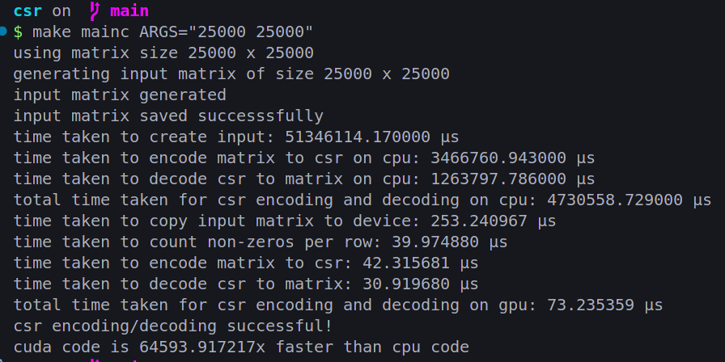

# CSR Matrix Notes

## What's CSR Actually

CSR = Compressed Sparse Row. basically a way to store matrices that are mostly zeros without wasting memory.

normal matrix storage is dumb for sparse data. like if you got a 1000x1000 matrix with only 100 non-zero values, why store 1 million numbers? just store the 100 that matter.

### CSR Format Breakdown

three arrays:

- **values**: the actual non-zero numbers
- **col_indices**: which column each value belongs to
- **row_ptr**: where each row starts in the values array (size = rows + 1)

example time:

original matrix:

```
| 0 0 3 0 |
| 1 0 0 2 |
| 0 4 0 0 |
| 0 0 0 5 |
```

CSR representation:

- values = [3, 1, 2, 4, 5]
- col_indices = [2, 0, 3, 1, 3]
- row_ptr = [0, 1, 3, 4, 5]

row_ptr tells you: row 0 values are from index 0 to 1 (exclusive), row 1 from 1 to 3, etc.

### Encoding

go through matrix row by row. for each non-zero value, store the value and its column index. keep track of where each row starts.

```
row 0: find 3 at col 2 => values[0]=3, col_indices[0]=2
row 1: find 1 at col 0 => values[1]=1, col_indices[1]=0
       find 2 at col 3 => values[2]=2, col_indices[2]=3
... and so on
```

### Decoding

reverse process. go through each row using row_ptr to find start/end indices in values array. place each value back at its column position.

```
for row 0: row_ptr[0]=0, row_ptr[1]=1
  => values[0]=3 goes to matrix[0][2]
for row 1: row_ptr[1]=1, row_ptr[2]=3
  => values[1]=1 goes to matrix[1][0]
  => values[2]=2 goes to matrix[1][3]
```

## Three Approaches (my thought process)

### Approach 1: CPU Sequential (easiest)

just loop through everything on CPU. single threaded.

```cpp
// count non-zeros
for (int i = 0; i < r*c; i++) {
    if (mat[i] != 0) nnz++;
}

// encode
for each row:
    for each col:
        if (val != 0) store it
```

### Approach 2: Naive GPU Parallelization (better but meh)

throw entire matrix on GPU, one thread per element.

```cuda
__global__ void naiveEncode(...) {
    int idx = blockIdx.x * blockDim.x + threadIdx.x;
    if (mat[idx] != 0) {
        // atomic operations to store
        // lots of thread conflicts
    }
}
```

**problems:**

- race conditions everywhere
- needs atomic operations
- irregular memory access patterns

### Approach 3: Row-Based Parallelization (current implementation)

one thread per row. each thread handles its own row independently.

**why it's better:**

- no race conditions between threads
- each thread works on contiguous memory

encode: each thread counts its row, stores values for that row.\
decode: each thread reconstructs its row from CSR.

way more efficient. threads don't step on each other. memory access is cleaner.

## Current Code Walkthrough

### Main Flow

```
1. create random sparse input matrix
2. read it back from file
3. copy to GPU
4. count non-zeros per row (parallel)
5. build row_ptr array (CPU prefix sum)
6. encode to CSR (parallel)
7. decode back to matrix (parallel)
8. verify correctness
```

### Input Generation (`createInput`)

generates random sparse matrix. roughly 80% zeros (r > 8 check gives ~20% non-zeros).

writes to `input.txt`:

```
rows
cols
element1
element2
...
```

nothing fancy. just setup for testing.

### CSR Encoding

**Step 1: Count Non-Zeros Per Row**

```cuda
__global__ void countNonZerosPerRow(...)
```

each thread gets one row. loops through columns, counts non-zeros. stores count in `d_rowCounts`.

parallel counting. no conflicts since each thread writes to its own index.

**Step 2: Build row_ptr Array**

- here the first thought was to use prefix sums, but...
- prefix sum needs ungodly amount of memory for large matrices
- in my prefix sum test implementations
  - the memory usage blew up for large sizes as there are many intermediate arrays being created (especially during partial sum calculations and validations)
  - each step holds large temporary buffers in memory(could be wrong on this though)
- here in addition to that we have other arrays already allocated which increases memory pressure(input sparse matrix, row, col, val, etc)
- so, currently doing it on CPU, cuurently exploring prefix sums as there are a lot of variations

```cpp
h_row[0] = 0;
for (int i = 1; i < r + 1; i++) {
    h_row[i] = h_row[i-1] + h_rowCounts[i-1];
}
```

prefix sum. row_ptr[i] = total non-zeros in rows 0 to i-1.

`nnz = h_row[r]` gives total non-zero count.

**Step 3: Encode Values and Columns**

```cuda
__global__ void encode(...)
```

each thread handles one row:

1. get starting position from `d_row[row]`
2. loop through columns
3. if value != 0, store it in `d_val` and column in `d_col`
4. increment local index

no atomics needed. each thread writes to its own segment.

```cuda
int start = d_row[row];  // where this row starts
int idx = 0;
for (int col = 0; col < c; col++) {
    if (d_mat[row * c + col] != 0) {
        d_col[start + idx] = col;      // store column
        d_val[start + idx] = val;       // store value
        idx++;
    }
}
```

### CSR Decoding

```cuda
__global__ void decode(...)
```

reverse of encoding. each thread gets one row:

1. find start/end indices from `d_row`
2. loop through that range in values/cols arrays
3. place each value back in the matrix

```cuda
int start = d_row[row];
int end = d_row[row + 1];
for (int i = start; i < end; i++) {
    int col = d_col[i];
    int val = d_val[i];
    d_mat[row * c + col] = val;  // put it back
}
```

output matrix was memset to 0 first, so zeros stay zero. only write non-zeros.

### Memory Management

lots of mallocs and cudaMallocs:

- `h_mat`: original matrix on host
- `d_mat`: matrix on device
- `h_rowCounts`, `d_rowCounts`: per-row non-zero counts
- `h_row`, `d_row`: row pointer array
- `h_col`, `d_col`: column indices
- `h_val`, `d_val`: values
- `dd_mat`: decoded matrix on device
- `hd_mat`: decoded matrix copied back to host

everything gets freed at the end. clean cleanup.

### Timing

uses CUDA events for GPU operations:

```cpp
cudaEventRecord(c_start);
// ... kernel or memory copy ...
cudaEventRecord(c_stop);
cudaEventSynchronize(c_stop);
cudaEventElapsedTime(&elapsed, c_start, c_stop);
```

tracks:

- input file creation time (CPU clock_gettime)
- memory copy to device
- counting non-zeros
- encoding
- decoding

### Verification

`checkCSR` compares original matrix with decoded matrix element by element. if they match, encoding/decoding worked.

## Problems ran into / Future Improvements

- if rows have very different numbers of non-zeros, some threads finish early (load imbalance). but couldn't think of a better way

- memory usage spikes with large matrices during prefix sum attempts. need more efficient prefix sum or alternative.

## Benchmarks

### Test run



**complete end to end benchmarks will be added soon**
