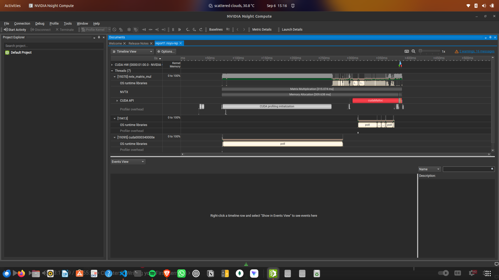

# Profiling

this is the commands to use next by next

```
nvcc -o nvtx_matrix_mul nvtx_matrix_mul.cu -lnvToolsExt
./nvtx_matrix_mul 
nsys profile --stats=true ./nvtx_matrix_mul 
```

the results are stored in like:
1. [report1.nsys-rep](./report1.nsys-rep)
2. [report1.sqlite](./report1.sqlite)

## Sample ouput:
```
 ~/learn_cuda/profiling  on main ?1  nsys profile --stats=true ./nvtx_matrix_mul                                                                                                   ok  at 15:02:55 
WARNING: CPU IP/backtrace sampling not supported, disabling.
Try the 'nsys status --environment' command to learn more.

WARNING: CPU context switch tracing not supported, disabling.
Try the 'nsys status --environment' command to learn more.

Collecting data...
Generating '/tmp/nsys-report-6f25.qdstrm'
[1/8] [========================100%] report1.nsys-rep
[2/8] [========================100%] report1.sqlite
[3/8] Executing 'nvtx_sum' stats report

 Time (%)  Total Time (ns)  Instances    Avg (ns)       Med (ns)      Min (ns)     Max (ns)    StdDev (ns)   Style           Range         
 --------  ---------------  ---------  -------------  -------------  -----------  -----------  -----------  -------  ----------------------
     50.0      315,074,427          1  315,074,427.0  315,074,427.0  315,074,427  315,074,427          0.0  PushPop  :Matrix Multiplication
     49.1      309,638,435          1  309,638,435.0  309,638,435.0  309,638,435  309,638,435          0.0  PushPop  :Memory Allocation    
      0.4        2,693,294          1    2,693,294.0    2,693,294.0    2,693,294    2,693,294          0.0  PushPop  :Kernel Execution     
      0.3        1,647,235          1    1,647,235.0    1,647,235.0    1,647,235    1,647,235          0.0  PushPop  :Memory Copy D2H      
      0.1          811,866          1      811,866.0      811,866.0      811,866      811,866          0.0  PushPop  :Memory Copy H2D      
      0.0          280,953          1      280,953.0      280,953.0      280,953      280,953          0.0  PushPop  :Memory Deallocation  

[4/8] Executing 'osrt_sum' stats report

 Time (%)  Total Time (ns)  Num Calls    Avg (ns)     Med (ns)    Min (ns)   Max (ns)    StdDev (ns)            Name         
 --------  ---------------  ---------  ------------  -----------  --------  -----------  ------------  ----------------------
     73.7      272,787,580         11  24,798,870.9  1,495,983.0     1,128  209,894,173  62,157,267.9  poll                  
     25.6       94,644,569        457     207,099.7      8,472.0     1,042   10,360,014     732,172.3  ioctl                 
      0.3        1,051,091         25      42,043.6      6,011.0     2,783      718,762     141,995.7  mmap64                
      0.2          786,256          9      87,361.8     35,478.0     6,933      241,628      97,717.9  sem_timedwait         
      0.0          156,550         43       3,640.7      2,697.0     1,373        8,857       2,124.3  open64                
      0.0          138,013         34       4,059.2      2,385.5     1,013       24,849       4,771.6  fopen                 
      0.0           97,291         13       7,483.9      4,314.0     1,388       46,009      11,909.7  mmap                  
      0.0           80,094          3      26,698.0     29,575.0    17,296       33,223       8,344.2  pthread_create        
      0.0           41,576          1      41,576.0     41,576.0    41,576       41,576           0.0  pthread_cond_wait     
      0.0           32,870          5       6,574.0      7,831.0     1,460        9,797       3,558.2  fread                 
      0.0           25,403          1      25,403.0     25,403.0    25,403       25,403           0.0  fgets                 
      0.0           19,043          6       3,173.8      3,669.5     1,030        4,546       1,542.5  open                  
      0.0           15,308          9       1,700.9      1,687.0     1,273        2,258         328.7  read                  
      0.0           13,161          7       1,880.1      1,447.0     1,159        3,677         910.9  fclose                
      0.0           12,721          3       4,240.3      5,239.0     2,097        5,385       1,857.6  munmap                
      0.0           11,702          7       1,671.7      1,505.0     1,329        2,255         396.2  write                 
      0.0           11,563          2       5,781.5      5,781.5     3,476        8,087       3,260.5  socket                
      0.0            8,813          3       2,937.7      3,801.0     1,131        3,881       1,565.1  pipe2                 
      0.0            7,320          3       2,440.0      1,881.0     1,808        3,631       1,032.1  pthread_cond_broadcast
      0.0            5,630          1       5,630.0      5,630.0     5,630        5,630           0.0  connect               
      0.0            2,823          1       2,823.0      2,823.0     2,823        2,823           0.0  fcntl                 
      0.0            2,390          1       2,390.0      2,390.0     2,390        2,390           0.0  fwrite                
      0.0            1,601          1       1,601.0      1,601.0     1,601        1,601           0.0  bind                  

[5/8] Executing 'cuda_api_sum' stats report

 Time (%)  Total Time (ns)  Num Calls    Avg (ns)     Med (ns)    Min (ns)    Max (ns)   StdDev (ns)            Name         
 --------  ---------------  ---------  ------------  -----------  ---------  ----------  ------------  ----------------------
     93.7       81,269,209          3  27,089,736.3     31,596.0     29,944  81,207,669  46,867,504.5  cudaMalloc            
      2.9        2,522,457          1   2,522,457.0  2,522,457.0  2,522,457   2,522,457           0.0  cudaDeviceSynchronize 
      2.8        2,452,789          3     817,596.3    444,300.0    362,427   1,646,062     718,639.2  cudaMemcpy            
      0.3          279,265          3      93,088.3     94,544.0     83,094     101,627       9,351.9  cudaFree              
      0.2          164,261          1     164,261.0    164,261.0    164,261     164,261           0.0  cudaLaunchKernel      
      0.0              988          1         988.0        988.0        988         988           0.0  cuModuleGetLoadingMode

[6/8] Executing 'cuda_gpu_kern_sum' stats report

 Time (%)  Total Time (ns)  Instances   Avg (ns)     Med (ns)    Min (ns)   Max (ns)   StdDev (ns)                       Name                      
 --------  ---------------  ---------  -----------  -----------  ---------  ---------  -----------  -----------------------------------------------
    100.0        2,523,567          1  2,523,567.0  2,523,567.0  2,523,567  2,523,567          0.0  matrixMulKernel(float *, float *, float *, int)

[7/8] Executing 'cuda_gpu_mem_time_sum' stats report

 Time (%)  Total Time (ns)  Count  Avg (ns)   Med (ns)   Min (ns)  Max (ns)  StdDev (ns)           Operation          
 --------  ---------------  -----  ---------  ---------  --------  --------  -----------  ----------------------------
     56.4          959,117      1  959,117.0  959,117.0   959,117   959,117          0.0  [CUDA memcpy Device-to-Host]
     43.6          742,001      2  371,000.5  371,000.5   366,553   375,448      6,289.7  [CUDA memcpy Host-to-Device]

[8/8] Executing 'cuda_gpu_mem_size_sum' stats report

 Total (MB)  Count  Avg (MB)  Med (MB)  Min (MB)  Max (MB)  StdDev (MB)           Operation          
 ----------  -----  --------  --------  --------  --------  -----------  ----------------------------
      8.389      2     4.194     4.194     4.194     4.194        0.000  [CUDA memcpy Host-to-Device]
      4.194      1     4.194     4.194     4.194     4.194        0.000  [CUDA memcpy Device-to-Host]

Generated:
    /home/pradhep/learn_cuda/profiling/report1.nsys-rep
    /home/pradhep/learn_cuda/profiling/report1.sqlite
```

## Nvidia NSIGHT COMPUTE

drag and drop the nsys-rep([example](./report2.nsys-rep)) to ncu directly, and this is what you would get



pdf version of the profling from ncu = [pdf](./matrix_mul_ncu_Report.pdf)

things to look out for when optimzing:
1. memory throughput


# CUPTI
- allows you to build your own profiler tools
- The *CUDA Profiling Tools Interface* (CUPTI) enables the creation of profiling and tracing tools that target CUDA applications. CUPTI provides the following APIs: the *Activity API*, the *Callback API*, the *Event API*, the *Metric API*, the *Profiling API*, the *PC Sampling API*, the *SASS Metric API* and the *Checkpoint API*. Using these APIs, you can develop profiling tools that give insight into the CPU and GPU behavior of CUDA applications. CUPTI is delivered as a dynamic library on all platforms supported by CUDA.
- https://docs.nvidia.com/cupti/overview/overview.html
- Since CUPTI has a steeper learning curve, we are keeping it simple with the other profiler tools in this course.