# Streams and Concurrency in CUDA

Referring this documentation: [Streams and Concurrency official Explanation in a webinar](https://developer.download.nvidia.com/CUDA/training/StreamsAndConcurrencyWebinar.pdf)

## Stream

Official def:
> A sequence of operations that execute in issue-order on the GPU

The thing i understood when i read this def is that issue order as in we schedule the lauch of kernel, or even kernel ops, as in which should happen when, this gives us a whole bunch of control and an **abstraction** layer that makes our life easier, and i see this more similar to <i><b>nn.Sequential</b></i>

This is best explained from this image, and we can relate this to the **pipeline** concept from OS:
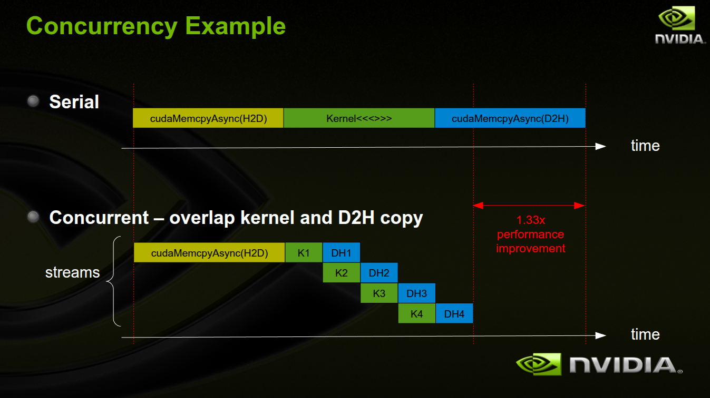

---
so there's a prerequisite required before proceeding -> [Pinned Memory](./pinned_mem.md)

---

This image explains the types and what is exactly pipelined or cincurrently executed over here:
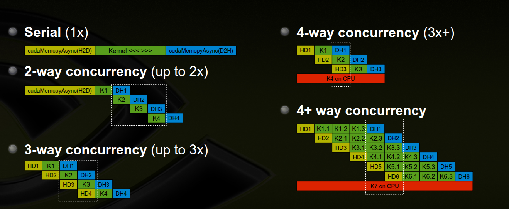

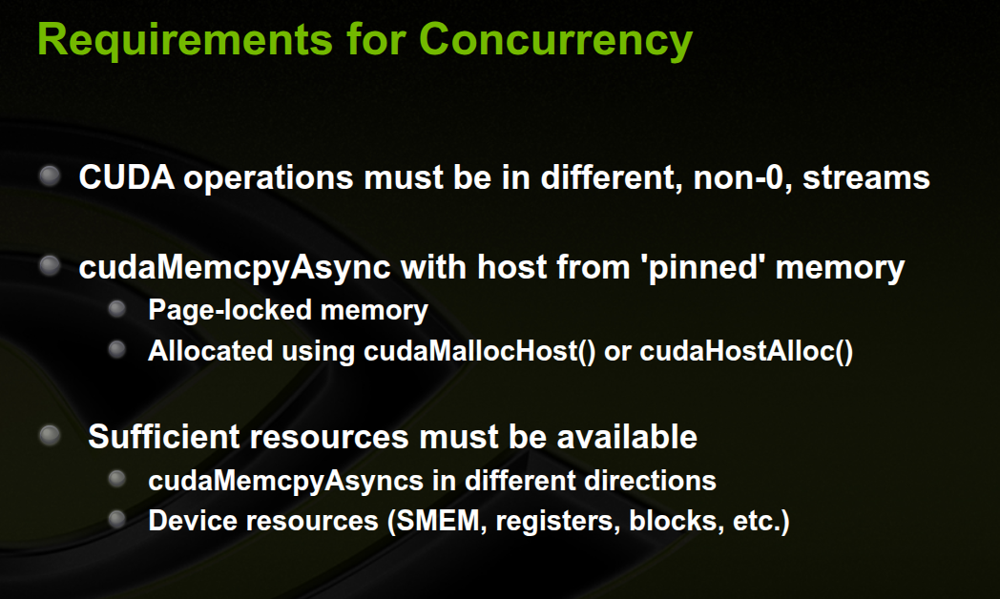

### Benchmarking two cuda kernels execution with and without streams
1. with streams -> [with_stream](./with_stream.cu)
2. without streams -> [without_stream](./without_stream.cu)

Results:
```                                                                                                                            
Time taken without streams: 2.520098 seconds
Total time with streams: 2.468231 seconds
```

## Events

So my understanding of events is that, you can use diff streams ad parallelize inside an event, something like <i><b>super-pipelining</b></i>

Code -> [using_events](./using_events.cu)

Results:
```
Total time with events and streams: 0.001205 seconds
Stream 0 - H2D: 0.233 ms, Kernel: 0.288 ms, D2H: 0.443 ms
Stream 1 - H2D: 0.561 ms, Kernel: 0.584 ms, D2H: 0.744 ms
Stream 2 - H2D: 0.821 ms, Kernel: 0.830 ms, D2H: 0.988 ms
Stream 3 - H2D: 1.077 ms, Kernel: 1.090 ms, D2H: 1.200 ms
```

## Stream Scheduling

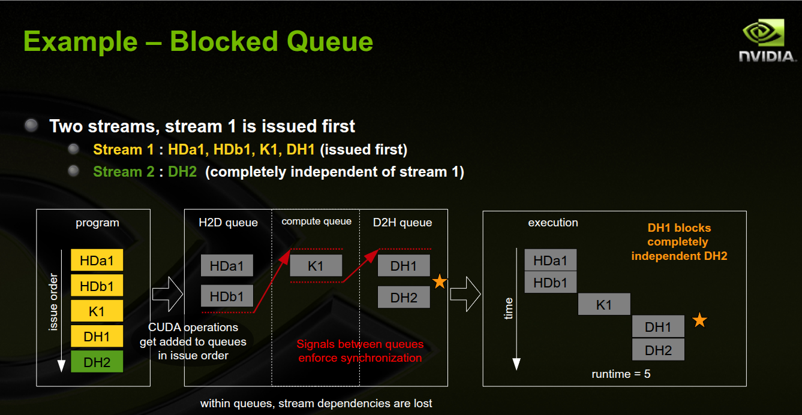
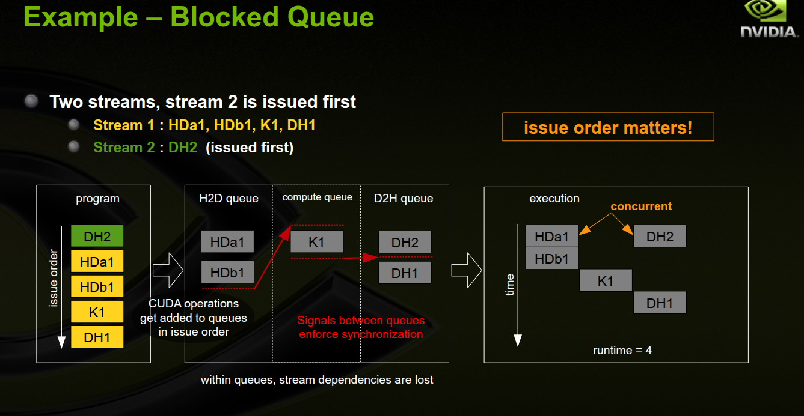
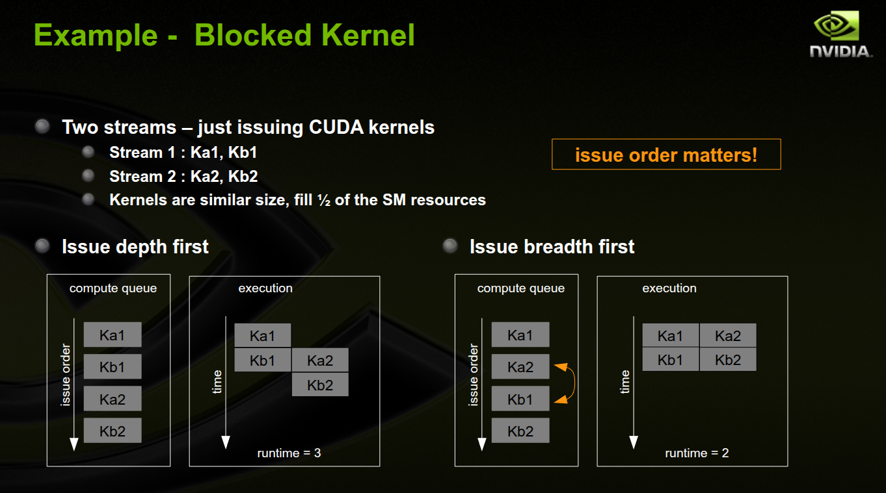
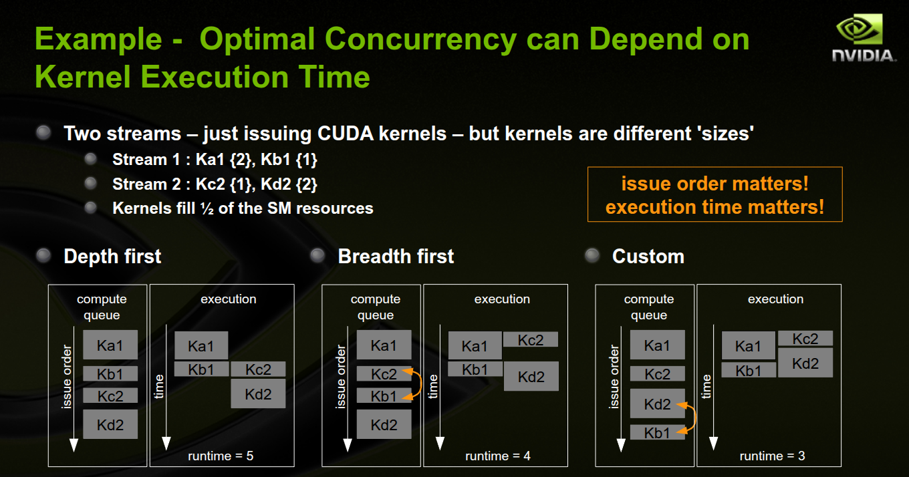


---
#### Concurrent Kernel Scheduling
- Concurrent kernel scheduling is special
- Normally, a signal is inserted into the queues, after the operation, tolaunch the next operation in the same stream
- For the compute engine queue, to enable concurrent kernels, whencompute kernels are issued sequentially, this signal is delayed untilafter the last sequential compute kernel
- In some situations this delay of signals can block other queues

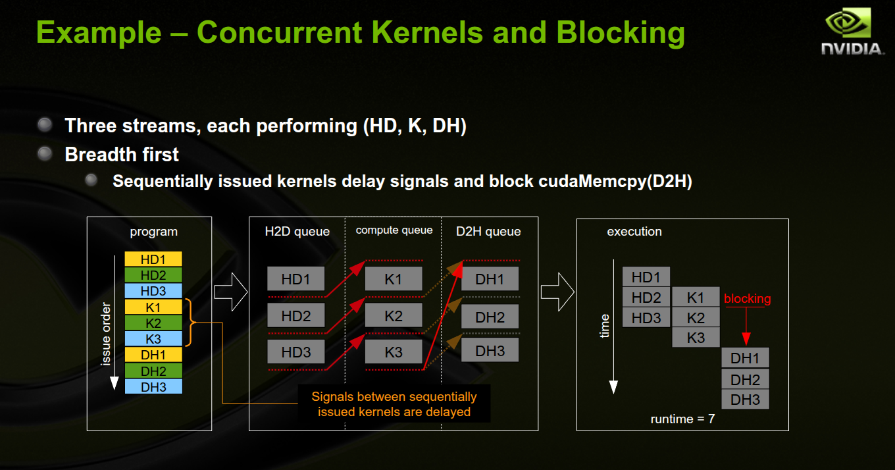
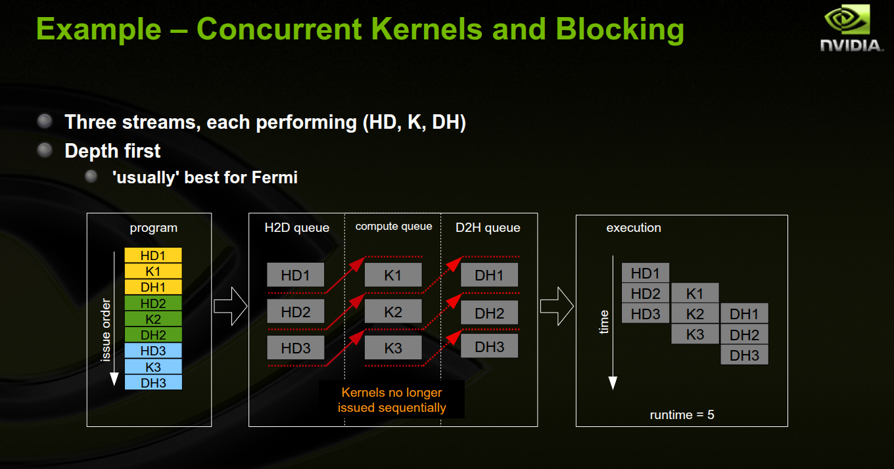

---

### Two more important details:

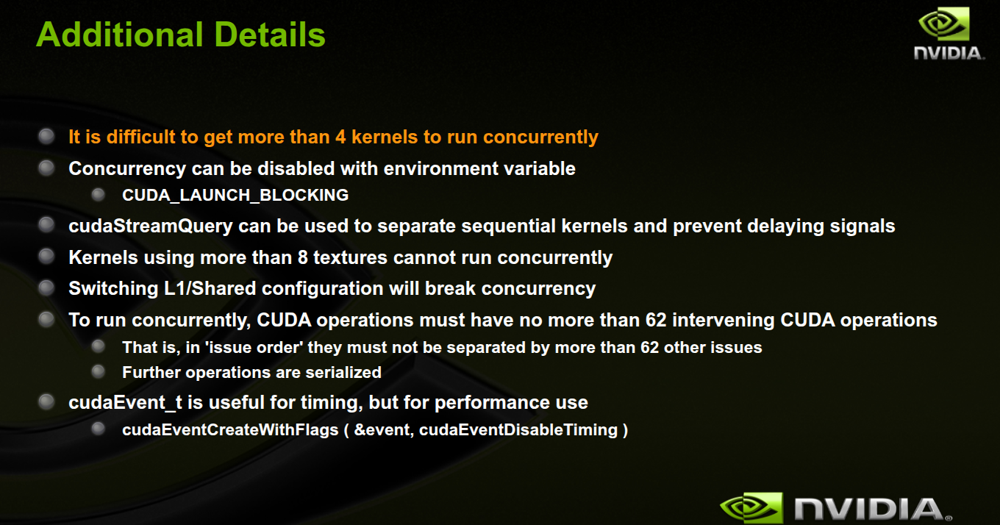
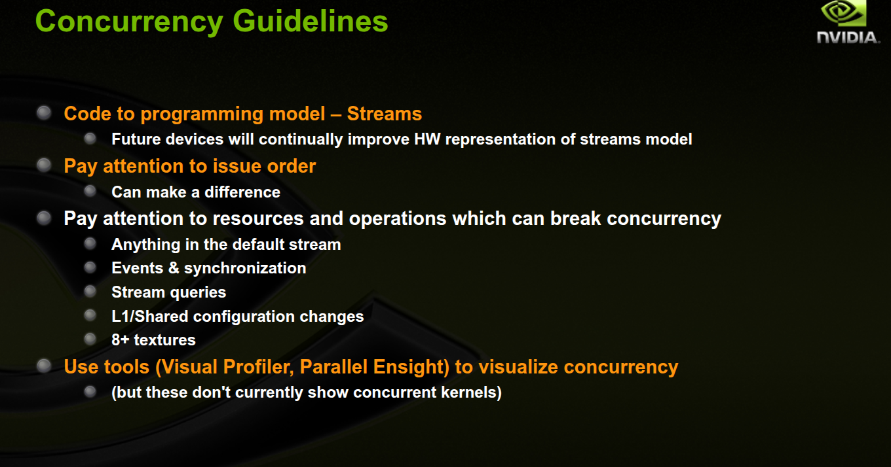