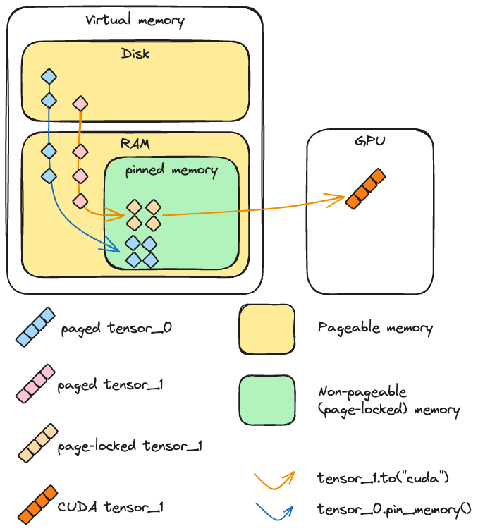
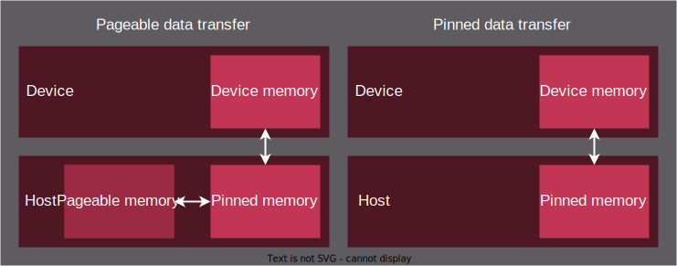

# PINNED MEMORY

So the issue without a locked memory (aka <i><b>Pinned Memory</b></i>) is that, let's say we store an amount of mem needed for the kernel, but as the ram gets full, it goes into the swap memory, leading or the gpu to check in the ram first, and then if its not present go to the swapped mem and access it. But this slows down the process, so pinned mem what it does is that, lock some mem in ram, and stores it there itself no matter what, and the gpu gets access for dma(direct memory access without cpu intervention), and then access the data, this is something like caching optimization moving from a system of cache miss to optmizing the caching algo 😁.

The code block to insert in everything is that
```
cudaMallocHost(x, size)
```

some diagrams for more clarity though




Benchmarking:

#### Without Pinned Mem:
```
 ~/learn_cuda/streams  on main ?4  ./without_pinned_mem                                                                                                                          127 err  at 15:44:02 
benchmarking cpu implementation...
benchmarking gpu implementation without shared mem....
benchmarking gpu implementation with shared mem....
CPU average time: 0.003329 seconds
GPU average time (no shared mem): 0.000001 seconds
GPU average time (with shared mem): 0.000000 seconds
Speedup (CPU to GPU no shared mem): 2663.46x
Speedup (CPU to GPU with shared mem): 19335.78x
Speedup (GPU no shared mem to GPU with shared mem): 7.26x
Total time: 1.676762 seconds
```

#### With Pinned Mem:
```
 ~/learn_cuda/streams  on main ?4  ./with_pinned_mem                                                                                                                         ok  took 3s  at 15:59:19 
Allocating pinned memory...
benchmarking cpu implementation...
benchmarking gpu implementation without shared mem....
benchmarking gpu implementation with shared mem....
CPU average time: 0.003838 seconds
GPU average time (no shared mem): 0.000037 seconds
GPU average time (with shared mem): 0.000023 seconds
Speedup (CPU to GPU no shared mem): 104.24x
Speedup (CPU to GPU with shared mem): 169.80x
Speedup (GPU no shared mem to GPU with shared mem): 1.63x
Total time with pinned mem: 2.709714 seconds
```

